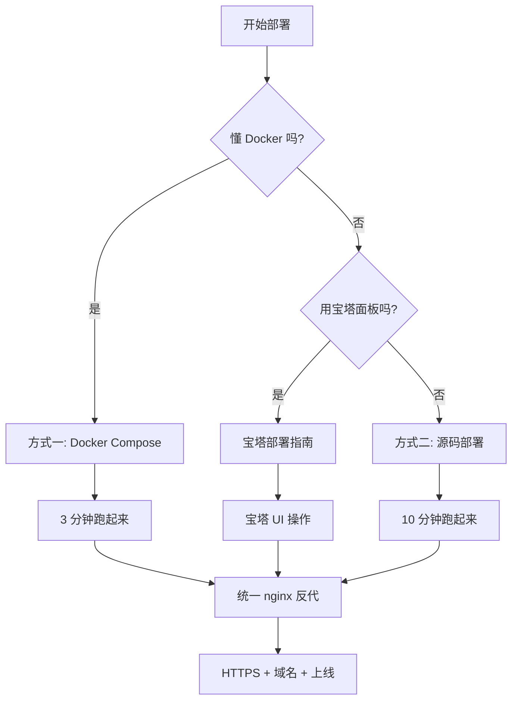

# Linux 服务器部署指南

> 本文档是 **`resume-matcher-agent-cn`** 在**通用 Linux 服务器**上的完整部署手册。
> 覆盖：硬件/系统要求、两种部署方式（Docker / 源码）、Nginx 反代、HTTPS、备份、日志、监控、升级、性能调优、问题排查。
>
> 宝塔面板用户请走 [`docs/BAOTA_DEPLOY.md`](./BAOTA_DEPLOY.md)。
>
> 返回 → [项目主 README](../README.md)

---

## 目录

1. [服务器最低要求](#1-服务器最低要求)
2. [部署方式选择](#2-部署方式选择)
3. [方式一：Docker Compose 部署（最快）](#3-方式一docker-compose-部署最快)
4. [方式二：源码部署（含 systemd 服务化）](#4-方式二源码部署含-systemd-服务化)
5. [Nginx 反向代理（同源反代 + HTTPS）](#5-nginx-反向代理同源反代--https)
6. [防火墙与安全加固](#6-防火墙与安全加固)
7. [数据备份与恢复](#7-数据备份与恢复)
8. [日志查看与轮转](#8-日志查看与轮转)
9. [健康检查与监控](#9-健康检查与监控)
10. [升级与回滚](#10-升级与回滚)
11. [性能调优](#11-性能调优)
12. [常见部署问题排查](#12-常见部署问题排查)

---

## 1. 服务器最低要求

### 1.1 硬件

| 配置 | 最低 | 推荐 | 适用场景 |
| --- | --- | --- | --- |
| CPU | 1 vCPU | 2 vCPU | 1-10 并发用户 |
| 内存 | 1 GB | 2 GB | Gunicorn 2 worker |
| 硬盘 | 10 GB | 20 GB | 系统 + JSON 存储 + 日志 |
| 带宽 | 1 Mbps | 5 Mbps | 简历上传 + 流式响应 |

> 简历上传峰值 20MB（nginx 限制），JSON 存储约 10KB / 份，普通使用一年累积 < 100MB。

### 1.2 操作系统

已测试可运行的发行版：

- **Ubuntu** 20.04 LTS / 22.04 LTS / 24.04 LTS
- **Debian** 11 / 12
- **CentOS** 7+ / Rocky Linux 8+ / AlmaLinux 8+
- **Alibaba Cloud Linux** 3（OpenAnolis 兼容）

> 所有发行版都需要 64 位（`x86_64` / `amd64` / `arm64`）。

### 1.3 软件依赖

| 软件 | Docker 方式 | 源码方式 | 用途 |
| --- | --- | --- | --- |
| Docker Engine | 20.10+ | — | 容器化运行 |
| Docker Compose | v2+ | — | 多服务编排 |
| Python | — | 3.12+ | 后端解释器 |
| Node.js | — | 20 LTS+ | 前端构建 |
| Nginx | 可选 | **推荐** | 反向代理 + HTTPS |
| systemd | — | 推荐 | 服务守护 |
| curl | 需要 | 需要 | 验证用 |

## 2. 部署方式选择



**对比**：

| 维度 | Docker | 源码 |
| --- | --- | --- |
| 部署速度 | ⚡ 最快（3-5 分钟） | 🐢 较慢（10-15 分钟） |
| 升级回滚 | ⚡ `docker compose pull` | 🐢 `git pull` + 重建 |
| 资源占用 | 多一层容器化开销 | 直接用宿主机资源 |
| 调试 | 容器日志 | 直接看进程 / systemd journal |
| 适用人群 | 任何 Linux 用户 | 喜欢掌控细节的运维 |

## 3. 方式一：Docker Compose 部署（最快）

### 3.1 准备

```bash
# 1. 安装 Docker（如果还没装）
curl -fsSL https://get.docker.com -o get-docker.sh
sudo sh get-docker.sh
sudo usermod -aG docker $USER  # 当前用户免 sudo
# 注销重登生效

# 2. 验证 Docker
docker --version
docker compose version
```

### 3.2 拉取代码

```bash
# 推荐路径
sudo mkdir -p /opt/resume-matcher
sudo chown $USER:$USER /opt/resume-matcher
cd /opt/resume-matcher

git clone <你的仓库地址> .
# 或上传代码包：scp resume-matcher-agent-cn.zip user@server:/opt/resume-matcher/
```

### 3.3 配置环境

```bash
cp apps/backend/.env.sample apps/backend/.env
vim apps/backend/.env
```

**生产环境最小配置**：

```env
ENV="production"
SESSION_SECRET_KEY="<用 python -c 'import secrets; print(secrets.token_urlsafe(32))' 生成>"
LLM_API_KEY="<你的真实 API Key>"
LLM_BASE_URL="https://open.bigmodel.cn/api/paas/v4/"
LLM_MODEL="glm-5.1"
# 同源反代部署，ALLOWED_ORIGINS 留空即可
ALLOWED_ORIGINS=""
# 日志目录用容器内绝对路径（compose 已挂载到 named volume）
LOG_DIR="/app/logs"
```

### 3.4 启动

```bash
# 后台启动
docker compose up -d --build

# 跟日志
docker compose logs -f
# Ctrl+C 退出（容器不停止）

# 查看状态
docker compose ps
```

### 3.5 验证

```bash
# 健康检查
curl http://127.0.0.1:8000/ping
# 期望：{"message":"pong","database":"reachable"}

# 前端首页
curl -I http://127.0.0.1:3000
# 期望：HTTP/1.1 200 OK
```

### 3.6 数据位置

Docker 把数据放在 **named volumes**（即使 `docker compose down` 也不会丢）：

```bash
# 查看
docker volume inspect resume-matcher-agent-cn_backend-data
docker volume inspect resume-matcher-agent-cn_backend-logs

# 备份（推荐写成 cron）
docker run --rm \
  -v resume-matcher-agent-cn_backend-data:/data:ro \
  -v $(pwd)/backups:/backup \
  alpine tar czf /backup/data-$(date +%Y%m%d).tar.gz -C /data .
```

## 4. 方式二：源码部署（含 systemd 服务化）

> 适合裸机部署、需要直接调优、或不喜欢 Docker 的场景。

### 4.1 创建专用用户（推荐）

```bash
# 避免用 root 跑服务
sudo useradd -r -m -s /bin/bash resume
sudo mkdir -p /opt/resume-matcher
sudo chown resume:resume /opt/resume-matcher
```

### 4.2 拉取代码

```bash
sudo -u resume -i
cd /opt/resume-matcher
git clone <仓库地址> .
```

### 4.3 装 Python 与 Node

**Ubuntu / Debian**：

```bash
sudo apt update
sudo apt install -y python3.12 python3.12-venv python3-pip nodejs npm nginx

# 确认 node ≥ 20
node -v   # 如果 < 20，参考 https://github.com/nodesource/distributions
```

**CentOS / Rocky / AlmaLinux**：

```bash
sudo dnf install -y python3.12 python3.12-devel nodejs npm nginx
```

### 4.4 配置后端

```bash
cd /opt/resume-matcher/apps/backend
cp .env.sample .env
vim .env
```

**生产配置**（注意 `LOG_DIR` 改成绝对路径）：

```env
ENV="production"
SESSION_SECRET_KEY="<生成一个随机字符串>"
LLM_API_KEY="<你的真实 API Key>"
LLM_BASE_URL="https://open.bigmodel.cn/api/paas/v4/"
LLM_MODEL="glm-5.1"
LOG_DIR="/var/log/resume-matcher"
```

创建日志目录：

```bash
sudo mkdir -p /var/log/resume-matcher
sudo chown resume:resume /var/log/resume-matcher
```

安装依赖：

```bash
python3.12 -m venv .venv
source .venv/bin/activate
pip install -r requirements.txt
deactivate
```

### 4.5 systemd 服务：后端

创建 `/etc/systemd/system/resume-backend.service`：

```ini
[Unit]
Description=Resume Matcher Backend (Flask + Gunicorn)
After=network.target

[Service]
Type=simple
User=resume
Group=resume
WorkingDirectory=/opt/resume-matcher/apps/backend
Environment="PATH=/opt/resume-matcher/apps/backend/.venv/bin"
EnvironmentFile=/opt/resume-matcher/apps/backend/.env
ExecStart=/opt/resume-matcher/apps/backend/.venv/bin/gunicorn \
  -w 2 \
  -b 127.0.0.1:8000 \
  --timeout 300 \
  --access-logfile - \
  --error-logfile - \
  app:app
Restart=always
RestartSec=5
StandardOutput=journal
StandardError=journal

# 安全加固
NoNewPrivileges=true
PrivateTmp=true
ProtectSystem=strict
ProtectHome=true
ReadWritePaths=/opt/resume-matcher/apps/backend/data /var/log/resume-matcher

[Install]
WantedBy=multi-user.target
```

启动：

```bash
sudo systemctl daemon-reload
sudo systemctl enable resume-backend
sudo systemctl start resume-backend
sudo systemctl status resume-backend
```

### 4.6 构建前端

```bash
cd /opt/resume-matcher/apps/frontend
cp .env.sample .env
vim .env
```

**同源反代**：

```env
NEXT_PUBLIC_API_URL=""
```

**跨域部署**（前端和后端不同域名）：

```env
NEXT_PUBLIC_API_URL="https://api.yourdomain.com"
```

```bash
# 用专门的非 root 用户
sudo chown -R resume:resume /opt/resume-matcher/apps/frontend
sudo -u resume bash
cd /opt/resume-matcher/apps/frontend
npm install
npm run build
exit
```

### 4.7 systemd 服务：前端

创建 `/etc/systemd/system/resume-frontend.service`：

```ini
[Unit]
Description=Resume Matcher Frontend (Next.js)
After=network.target resume-backend.service

[Service]
Type=simple
User=resume
Group=resume
WorkingDirectory=/opt/resume-matcher/apps/frontend
Environment="PATH=/opt/resume-matcher/apps/frontend/node_modules/.bin:/usr/bin"
EnvironmentFile=/opt/resume-matcher/apps/frontend/.env
ExecStart=/usr/bin/npm run start
Restart=always
RestartSec=5
StandardOutput=journal
StandardError=journal

NoNewPrivileges=true
PrivateTmp=true
ProtectSystem=strict
ProtectHome=true
ReadWritePaths=/opt/resume-matcher/apps/frontend

[Install]
WantedBy=multi-user.target
```

```bash
sudo systemctl daemon-reload
sudo systemctl enable resume-frontend
sudo systemctl start resume-frontend
sudo systemctl status resume-frontend
```

### 4.8 验证

```bash
# 进程检查
ss -tlnp | grep -E '(8000|3000)'

# 健康检查
curl http://127.0.0.1:8000/ping
curl -I http://127.0.0.1:3000

# systemd 日志
sudo journalctl -u resume-backend -f
sudo journalctl -u resume-frontend -f
```

## 5. Nginx 反向代理（同源反代 + HTTPS）

> 强烈推荐用 nginx 做同源反代，**避免 CORS 配置、流式响应缓冲、HTTPS 证书等所有坑**。

### 5.1 同源反代配置

创建 `/etc/nginx/conf.d/resume-matcher.conf`：

```nginx
# ── HTTP 入口：80 端口全部 301 到 HTTPS ──
server {
    listen 80;
    listen [::]:80;
    server_name yourdomain.com www.yourdomain.com;

    # Let's Encrypt 校验路径必须放行
    location /.well-known/acme-challenge/ {
        root /var/www/html;
    }

    location / {
        return 301 https://$host$request_uri;
    }
}

# ── HTTPS 主站 ──
server {
    listen 443 ssl http2;
    listen [::]:443 ssl http2;
    server_name yourdomain.com www.yourdomain.com;

    # SSL 证书（Let's Encrypt 或自签）
    ssl_certificate     /etc/letsencrypt/live/yourdomain.com/fullchain.pem;
    ssl_certificate_key /etc/letsencrypt/live/yourdomain.com/privkey.pem;
    ssl_protocols TLSv1.2 TLSv1.3;
    ssl_ciphers HIGH:!aNULL:!MD5;
    ssl_session_cache shared:SSL:10m;
    ssl_session_timeout 1d;

    # 安全 headers
    add_header X-Frame-Options "SAMEORIGIN" always;
    add_header X-Content-Type-Options "nosniff" always;
    add_header Referrer-Policy "strict-origin-when-cross-origin" always;

    # 简历上传体积
    client_max_body_size 20M;

    # 日志
    access_log /var/log/nginx/resume-matcher.access.log;
    error_log  /var/log/nginx/resume-matcher.error.log;

    # ── 后端 API（必须放在 / 之前） ──
    location /api/ {
        proxy_pass http://127.0.0.1:8000;
        proxy_set_header Host              $host;
        proxy_set_header X-Real-IP         $remote_addr;
        proxy_set_header X-Forwarded-For   $proxy_add_x_forwarded_for;
        proxy_set_header X-Forwarded-Proto $scheme;

        proxy_http_version 1.1;
        proxy_read_timeout 300s;
        proxy_send_timeout 300s;

        # ⚠️ 流式响应（SSE）必须关闭缓冲
        proxy_buffering     off;
        proxy_cache         off;
        proxy_set_header    Connection "";  # 让后端 SSE 长连接工作
    }

    # ── 前端（其余全部） ──
    location / {
        proxy_pass http://127.0.0.1:3000;
        proxy_set_header Host              $host;
        proxy_set_header X-Real-IP         $remote_addr;
        proxy_set_header X-Forwarded-For   $proxy_add_x_forwarded_for;
        proxy_set_header X-Forwarded-Proto $scheme;

        proxy_http_version 1.1;
        proxy_set_header Upgrade           $http_upgrade;
        proxy_set_header Connection        "upgrade";
    }
}
```

启用 + 验证：

```bash
sudo nginx -t                  # 检查语法
sudo systemctl reload nginx    # 不中断重载
```

### 5.2 HTTPS 证书

**Let's Encrypt（推荐，免费）**：

```bash
sudo apt install certbot python3-certbot-nginx   # Ubuntu/Debian
# 或
sudo dnf install certbot python3-certbot-nginx   # CentOS

sudo certbot --nginx -d yourdomain.com -d www.yourdomain.com
# 按提示填邮箱、同意条款；自动修改 nginx 配置、自动续期
```

**证书自动续期**（certbot 已自带 systemd timer）：

```bash
# 测试续期
sudo certbot renew --dry-run

# 看 timer 状态
sudo systemctl status certbot.timer
```

**自签证书**（仅内网测试用）：

```bash
sudo openssl req -x509 -nodes -days 365 -newkey rsa:2048 \
  -keyout /etc/ssl/private/resume-selfsigned.key \
  -out /etc/ssl/certs/resume-selfsigned.crt \
  -subj "/CN=yourdomain.com"

# nginx 里把 ssl_certificate / ssl_certificate_key 改成上面两个路径
```

### 5.3 最终验证

```bash
# HTTPS 前端
curl -I https://yourdomain.com

# HTTPS 后端
curl https://yourdomain.com/ping
# 期望：{"message":"pong","database":"reachable"}

# CORS 验证（应返回 CORS 头）
curl -I -H "Origin: https://yourdomain.com" https://yourdomain.com/api/v1/resumes
```

## 6. 防火墙与安全加固

### 6.1 防火墙（ufw / firewalld 二选一）

**Ubuntu / Debian（ufw）**：

```bash
sudo ufw allow 22/tcp        # SSH
sudo ufw allow 80/tcp        # HTTP
sudo ufw allow 443/tcp       # HTTPS
sudo ufw enable
sudo ufw status
```

**CentOS / Rocky（firewalld）**：

```bash
sudo firewall-cmd --permanent --add-service=ssh
sudo firewall-cmd --permanent --add-service=http
sudo firewall-cmd --permanent --add-service=https
sudo firewall-cmd --reload
sudo firewall-cmd --list-all
```

> **重要**：后端 8000、前端 3000 端口**不要**对外暴露，仅监听 127.0.0.1 即可（前面配置都是这样）。

### 6.2 fail2ban 防 SSH 爆破

```bash
sudo apt install fail2ban        # Ubuntu/Debian
sudo dnf install fail2ban        # CentOS
sudo systemctl enable --now fail2ban
```

### 6.3 自动安全更新（Ubuntu）

```bash
sudo apt install unattended-upgrades
sudo dpkg-reconfigure -plow unattended-upgrades   # 选 Yes
```

## 7. 数据备份与恢复

### 7.1 备份脚本

创建 `/opt/resume-matcher/scripts/backup.sh`：

```bash
#!/bin/bash
# 备份 JSON 存储 + .env + 上传过的简历原始文件
# 推荐 cron: 0 3 * * * /opt/resume-matcher/scripts/backup.sh

set -euo pipefail

BACKUP_DIR="/var/backups/resume-matcher"
DATA_DIR="/opt/resume-matcher/apps/backend/data"
ENV_FILE="/opt/resume-matcher/apps/backend/.env"
TIMESTAMP=$(date +%Y%m%d-%H%M%S)
ARCHIVE="${BACKUP_DIR}/resume-matcher-${TIMESTAMP}.tar.gz"

mkdir -p "${BACKUP_DIR}"

tar czf "${ARCHIVE}" \
  -C "$(dirname "${DATA_DIR}")" \
  "$(basename "${DATA_DIR}")"

# 同时备份 .env（生产密钥）
if [ -f "${ENV_FILE}" ]; then
  cp "${ENV_FILE}" "${BACKUP_DIR}/env-${TIMESTAMP}.bak"
  chmod 600 "${BACKUP_DIR}/env-${TIMESTAMP}.bak"
fi

# 保留最近 30 天
find "${BACKUP_DIR}" -type f -mtime +30 -delete

echo "[$(date)] Backup complete: ${ARCHIVE}"
```

```bash
chmod +x /opt/resume-matcher/scripts/backup.sh
```

### 7.2 配 cron 定时

```bash
sudo crontab -e
```

加入：

```cron
# 每天凌晨 3 点备份
0 3 * * * /opt/resume-matcher/scripts/backup.sh >> /var/log/resume-matcher-backup.log 2>&1
```

### 7.3 异地同步（可选但推荐）

```bash
# 用 rclone 同步到 S3 / OSS / 谷歌云盘
rclone sync /var/backups/resume-matcher remote:my-bucket/resume-matcher

# 或 rsync 到另一台服务器
rsync -az /var/backups/resume-matcher/ backup@backup-server:/backups/
```

### 7.4 恢复

```bash
# 1. 停服务
sudo systemctl stop resume-backend resume-frontend
# （Docker 方式：docker compose down）

# 2. 解压备份
tar xzf resume-matcher-20260616-030000.tar.gz -C /opt/resume-matcher/apps/backend/

# 3. 改权限
sudo chown -R resume:resume /opt/resume-matcher/apps/backend/data

# 4. 启服务
sudo systemctl start resume-backend resume-frontend
# （Docker 方式：docker compose up -d）
```

## 8. 日志查看与轮转

### 8.1 systemd 服务日志

```bash
# 实时跟踪后端日志
sudo journalctl -u resume-backend -f

# 看最近 100 行
sudo journalctl -u resume-backend -n 100 --no-pager

# 按时间范围
sudo journalctl -u resume-backend --since "2026-06-16 09:00" --until "2026-06-16 18:00"
```

### 8.2 Docker 日志

```bash
docker compose logs -f
docker compose logs --tail=200 backend
```

### 8.3 nginx 访问/错误日志

```bash
sudo tail -f /var/log/nginx/resume-matcher.access.log
sudo tail -f /var/log/nginx/resume-matcher.error.log
```

### 8.4 日志轮转

**systemd journal**（默认）：

```bash
sudo journalctl --vacuum-time=30d    # 只保留 30 天
sudo journalctl --vacuum-size=500M   # 最大 500M
```

**配置持久化**（编辑 `/etc/systemd/journald.conf`）：

```ini
[Journal]
SystemMaxUse=500M
MaxRetentionSec=30day
```

```bash
sudo systemctl restart systemd-journald
```

**nginx 日志轮转**（`/etc/logrotate.d/nginx`，通常已自带）：

```text
/var/log/nginx/*.log {
    daily
    missingok
    rotate 30
    compress
    delaycompress
    notifempty
    create 0640 www-data adm
    sharedscripts
    postrotate
        [ -f /var/run/nginx.pid ] && kill -USR1 $(cat /var/run/nginx.pid)
    endscript
}
```

## 9. 健康检查与监控

### 9.1 简单 cron 监控

```bash
# /opt/resume-matcher/scripts/healthcheck.sh
#!/bin/bash
set -euo pipefail

URL="${1:-https://yourdomain.com/ping}"
EXPECTED='"message":"pong"'

BODY=$(curl -sSf --max-time 10 "${URL}" || echo "")

if echo "${BODY}" | grep -q "${EXPECTED}"; then
  echo "[$(date)] OK"
  exit 0
else
  echo "[$(date)] FAIL: ${BODY}"
  exit 1
fi
```

```bash
chmod +x /opt/resume-matcher/scripts/healthcheck.sh

# 每 5 分钟检查，失败发邮件 / 钉钉 / 飞书
*/5 * * * * /opt/resume-matcher/scripts/healthcheck.sh || /opt/resume-matcher/scripts/alert.sh
```

### 9.2 systemd 自动重启

`/etc/systemd/system/resume-backend.service` 里已经有：

```ini
Restart=always
RestartSec=5
```

这意味着进程崩溃后 5 秒自动重启。

### 9.3 推荐监控

| 工具 | 类型 | 适用 |
| --- | --- | --- |
| **UptimeRobot** | 免费在线 | 单实例 + 公网域名 |
| **哪吒监控** | 开源自建 | 多服务器 |
| **Prometheus + Grafana** | 自建 | 大规模 |
| **阿里云 / 腾讯云监控** | 云厂商 | 国内服务器 |

## 10. 升级与回滚

### 10.1 升级（推荐用 git tag）

```bash
cd /opt/resume-matcher
sudo systemctl stop resume-backend resume-frontend

# 拉新代码
git fetch --tags
git checkout v0.2.0  # 或 git pull origin main

# 后端
cd apps/backend
source .venv/bin/activate
pip install -r requirements.txt
deactivate

# 前端（必须重新构建）
cd ../frontend
npm install
npm run build

# 启服务
sudo systemctl start resume-backend resume-frontend
sudo systemctl status resume-backend resume-frontend
```

### 10.2 Docker 升级

```bash
cd /opt/resume-matcher
git pull

docker compose up -d --build
# 数据卷 backend-data / backend-logs 自动保留
```

### 10.3 回滚

```bash
# 源码
sudo systemctl stop resume-backend resume-frontend
cd /opt/resume-matcher
git checkout v0.1.5    # 回到上一个 tag
cd apps/backend && source .venv/bin/activate && pip install -r requirements.txt
cd ../frontend && npm install && npm run build
sudo systemctl start resume-backend resume-frontend

# Docker
cd /opt/resume-matcher
git checkout v0.1.5
docker compose up -d --build
```

## 11. 性能调优

### 11.1 Gunicorn worker 数

`/etc/systemd/system/resume-backend.service` 里的 `-w 2`：

```bash
# 推荐公式：(2 × CPU核数) + 1
nproc  # 看 CPU 核数
# 1 核 → -w 3
# 2 核 → -w 5
# 4 核 → -w 9
```

### 11.2 nginx worker

`/etc/nginx/nginx.conf`：

```nginx
worker_processes auto;     # 自动等于 CPU 核数
worker_connections 2048;
```

### 11.3 文件描述符

高并发下要调大：

```bash
# /etc/security/limits.conf
*  soft  nofile  65535
*  hard  nofile  65535
```

### 11.4 内核参数

`/etc/sysctl.d/99-resume-matcher.conf`：

```ini
net.core.somaxconn = 4096
net.ipv4.tcp_max_syn_backlog = 4096
net.ipv4.tcp_tw_reuse = 1
fs.file-max = 2097152
```

```bash
sudo sysctl -p /etc/sysctl.d/99-resume-matcher.conf
```

## 12. 常见部署问题排查

### 12.1 502 Bad Gateway

```bash
# 1. 看后端是否在跑
sudo systemctl status resume-backend
ss -tlnp | grep 8000

# 2. 看后端日志
sudo journalctl -u resume-backend -n 100 --no-pager

# 3. 常见原因
#    - LLM_API_KEY 为空 / ENV=production 没填
#    - 端口被占
#    - .env 语法错误
```

### 12.2 413 Request Entity Too Large

nginx 默认 1M，配置里要加 `client_max_body_size 20M;`（本指南已含）。

### 12.3 流式响应不刷新（进度条卡住）

nginx 缓冲了 SSE。`location /api/` 里必须有：

```nginx
proxy_buffering off;
proxy_cache     off;
```

### 12.4 前端页面打开正常，但调用 API 报 CORS 错误

- **同源反代**：Nginx 配置正确则不会报 CORS。
- **跨域**：把前端域名加进后端 `ALLOWED_ORIGINS`，重启后端。

### 12.5 SSL 证书续期失败

```bash
# 看 certbot 错误
sudo certbot renew

# 常见原因：80 端口被占用 / 防火墙未放行
# 解决：暂时停 nginx 或确保 /.well-known/acme-challenge/ 可访问
```

### 12.6 磁盘空间满

```bash
# 查大文件
sudo du -sh /var/log/* /opt/resume-matcher/apps/backend/logs/*

# 清理 systemd journal
sudo journalctl --vacuum-time=7d

# 清理 docker
docker system prune -a
```

### 12.7 服务启动失败：`gunicorn: command not found`

`systemd` 服务里的 `Environment="PATH=..."` 没指对。检查 `.venv/bin/gunicorn` 是否存在：

```bash
ls -la /opt/resume-matcher/apps/backend/.venv/bin/gunicorn
```

### 12.8 修改 `.env` 后不生效

```bash
# systemd 不会自动重读 .env
sudo systemctl restart resume-backend

# Docker
docker compose restart backend
```

---

## 附录：相关文档

- 宝塔面板部署 → [`docs/BAOTA_DEPLOY.md`](./BAOTA_DEPLOY.md)
- 可视化编辑器集成（a4cv）→ 主 README 末节
- API 概览 → 主 README
